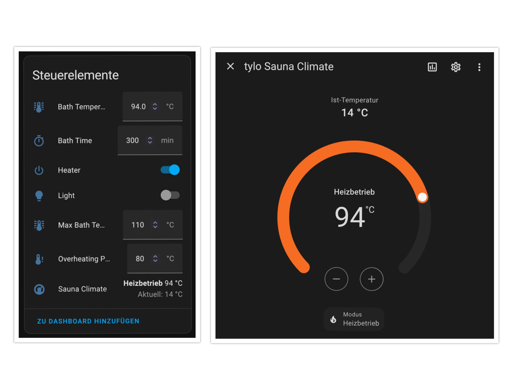

# Tylö Sense Pure

This interface was specifically developed and tested for the **Tylö Sense Pure** heater. Other Sauna360 heaters may also work, but compatibility is not guaranteed. This device does not emulate a panel and, therefore, cannot serve as a replacement.

---

## Hardware

### MCU

This project utilizes an **ESP32-S3 (ESP32-S3-WROOM-1)** paired with an external RS485-to-UART interface based on the **MAX485**. Although the **ESP32-C6** is theoretically capable of handling the task, **ESPHome** currently lacks support for suitable UART hardware interrupts.

### Door Sensor

The door sensor used in this project is an **ABUS FU7350W**.

### External Switch

The external switch with LED feedback used in this project can be found [here](https://amzn.eu/d/iFFPtIz).

### Sauna PCB


---

## Pinout and Wiring Diagram

### Connector Pinout (Western Connector 4P4C)

<table>
  <thead>
    <tr>
      <th>Pin</th>
      <th>Signal</th>
      <th> </th>
    </tr>
  </thead>
  <tbody>
    <tr>
      <td>1</td>
      <td>A</td>
      <th rowspan="4"></th>
    </tr>
    <tr>
      <td>2</td>
      <td>B</td>
    </tr>
    <tr>
      <td>3</td>
      <td>12V DC</td>
    </tr>
    <tr>
      <td>4</td>
      <td>GND</td>
    </tr>
  </tbody>
</table>

---

### Wiring Diagram

<table>
  <tbody>
    <tr>
      <th rowspan="4"></th>
    </tr>
  </tbody>
</table>

---

### Pinout Table

<table>
  <thead>
    <tr>
      <th>Pos</th>
      <th>Unit</th>
      <th>Use pin</th>
      <th>Comment</th>
      <th>Pin 1</th>
      <th>Pin 2</th>
      <th>Pin 3</th>
      <th>Pin 4</th>
    </tr>
  </thead>
  <tbody>
    <tr>
      <td>1 - NTC</td>
      <td>Temp. sensor in the room</td>
      <td>2, 3</td>
      <td>10kΩ. May also be connected at Pos 4 - SEC/NTC.</td>
      <td>-</td>
      <td>10kΩ</td>
      <td>10kΩ</td>
      <td>-</td>
    </tr>
    <tr>
      <td>2 - EXT SWITCH</td>
      <td>External switch</td>
      <td>3, 4</td>
      <td>Start/Stop. Momentary or latching switch</td>
      <td>-</td>
      <td>-</td>
      <td>Switch</td>
      <td>Switch</td>
    </tr>
    <tr>
      <td></td>
      <td>External switch with LED indication</td>
      <td>2, 3, 4</td>
      <td>Start/stop operation. 12VDC max. 40mA</td>
      <td>-</td>
      <td>Led GND</td>
      <td>Switch</td>
      <td>Switch / Led 12V</td>
    </tr>
    <tr>
      <td>3 - DOOR SWITCH</td>
      <td>Door contact (NO)</td>
      <td>3, 4</td>
      <td></td>
      <td>-</td>
      <td>-</td>
      <td>Switch</td>
      <td>Switch</td>
    </tr>
    <tr>
      <td></td>
      <td>Door contact (NO) with LED indication</td>
      <td>2, 3, 4</td>
      <td>12VDC max. 40mA.</td>
      <td>-</td>
      <td>Led GND</td>
      <td>Switch</td>
      <td>Switch / Led 12V</td>
    </tr>
    <tr>
      <td>4 - SEC/NTC</td>
      <td>Combined temperature sensor/cut-out in the room</td>
      <td>2, 3</td>
      <td>Only used for certain products.</td>
      <td>Sec</td>
      <td>10kΩ</td>
      <td>10kΩ</td>
      <td>Sec</td>
    </tr>
    <tr>
      <td>5-8 - RS485</td>
      <td>Control panels</td>
      <td>1, 2, 3, 4</td>
      <td>Tylö Pure control panel, ESP32 (RS485)</td>
      <td>A</td>
      <td>B</td>
      <td>12V</td>
      <td>GND</td>
    </tr>
  </tbody>
</table>

---

## Communication

### RS485 UART Communication Settings

<table>
  <thead>
    <tr>
      <th>Baud</th>
      <th>Bits</th>
      <th>Parity</th>
      <th>Stopbit</th>
    </tr>
  </thead>
  <tbody>
    <tr>
      <td>19200</td>
      <td>8</td>
      <td>Even</td>
      <td>1</td>
    </tr>
  </tbody>
</table>

---

### Message Format and Essential Bits

<p>These details have been reverse-engineered by analyzing intercepted communication between a heater and its control panel.  
As such, the list may not be complete or fully accurate. Further testing and validation may be required to confirm all behaviors and formats.</p>

---

### Keep-Alive Messages

<table>
  <thead>
    <tr>
      <th>Start of Frame (SOF)</th>
      <th>Address ID</th>
      <th>Message Type / Origin</th>
      <th>Data</th>
      <th>CRC</th>
      <th>End of Frame (EOF)</th>
    </tr>
  </thead>
  <tbody>
    <tr>
      <td rowspan="2"><code>0x98</code></td>
      <td rowspan="2"><code>0x40</code></td>
      <td><code>0x06</code></td>
      <td rowspan="2">0 Bytes</td>
      <td rowspan="2">2 Bytes</td>
      <td rowspan="2"><code>0x9C</code></td>
    </tr>
    <tr>
      <td><code>0x07</code></td>
    </tr>
    <tr>
      <td colspan="6">
        <strong>Explanation:</strong><br>
        <strong><code>0x06:</code></strong> Sent by the heater as a Keep-Alive request.<br>
        <strong><code>0x07:</code></strong> Sent by the control panel as a Keep-Alive acknowledgment.
      </td>
    </tr>
  </tbody>
</table>

---

### Message Structure

<table>
  <thead>
    <tr>
      <th>Start of Frame (SOF)</th>
      <th>Address ID</th>
      <th>Message Type / Origin</th>
      <th>Code</th>
      <th>Data</th>
      <th>CRC</th>
      <th>End of Frame (EOF)</th>
    </tr>
  </thead>
  <tbody>
    <tr>
      <td rowspan="4"><code>0x98</code></td>
      <td rowspan="4"><code>0x40</code></td>
      <td><code>0x06</code> (Heater Request)</td>
      <td>2 Bytes</td>
      <td rowspan="4">0–4 Bytes</td>
      <td rowspan="4">2 Bytes</td>
      <td rowspan="4"><code>0x9C</code></td>
    </tr>
    <tr>
      <td><code>0x07</code> (Panel Command)</td>
      <td>2 Bytes</td>
    </tr>
    <tr>
      <td><code>0x08</code> (Heater Data)</td>
      <td>2 Bytes</td>
    </tr>
    <tr>
      <td><code>0x09</code> (Panel Data / ACK?)</td>
      <td>2 Bytes</td>
    </tr>
  </tbody>
</table>

---

### Essential Codes and Their Descriptions

<table>
  <thead>
    <tr>
      <th>Code</th>
      <th>Description</th>
    </tr>
  </thead>
  <tbody>
    <tr>
      <td><code>0x3400</code></td>
      <td><strong>Light and Heater Status</strong></td>
    </tr>
    <tr>
      <td><code>0x4002</code></td>
      <td><strong>Bath Time and Maximum Temperature</strong></td>
    </tr>
    <tr>
      <td><code>0x4003</code></td>
      <td><strong>Overheating PCB Limit</strong></td>
    </tr>
    <tr>
      <td><code>0x6000</code></td>
      <td><strong>Temperature Data:</strong> Encodes current and target sauna temperature.</td>
    </tr>
    <tr>
      <td><code>0x7000</code></td>
      <td><strong>Request Heater Status Changes:</strong> Panel -> Heater</td>
    </tr>
    <tr>
      <td><code>0x7180</code></td>
      <td><strong>Light and Heater Status:</strong> Heater -> Panel</td>
    </tr>
    <tr>
      <td><code>0x9400</code></td>
      <td><strong>Total Uptime</strong></td>
    </tr>
    <tr>
      <td><code>0x9401</code></td>
      <td><strong>Remaining Time:</strong> Indicates the remaining time of the current sauna session.</td>
    </tr>
    <tr>
      <td><code>0xB000</code></td>
      <td><strong>Error Codes</strong></td>
    </tr>
    <tr>
      <td><code>0xB600</code></td>
      <td><strong>Sensor Errors</strong></td>
    </tr>
  </tbody>
</table>

---

# ESPHome Default Configuaration

```yaml
substitutions:
  device_name: "tylo"

external_components:
  - source:
      type: git
      url: https://github.com/f-io/esphome-tylo/
      ref: main
    refresh: 1s
    components: [ sauna360 ]
    
esphome:
  name: ${device_name}
  friendly_name: ${device_name}
  comment: ${device_name} sauna controller
  area: Sauna

esp32:
  board: esp32-s3-devkitc-1

logger:
  level: WARN
  baud_rate: 0

api:
  encryption:
    key: ""

ota:
  - platform: esphome
    password: ""

wifi:
  power_save_mode: NONE
  ssid: !secret wifi_ssid
  password: !secret wifi_password

uart:
    tx_pin: GPIO41
    rx_pin: GPIO42
    baud_rate: 19200
    data_bits: 8
    parity: EVEN
    stop_bits: 1

sauna360:
  id: sauna360_component

binary_sensor:
  - platform: sauna360
    heater_status:
      name: "Heater State"
  - platform: sauna360
    light_status:
      name: "Light State"
  - platform: sauna360
    ready_status: 
      name: "Ready State"

sensor:
  - platform: wifi_signal
    name: "${device_name} WiFi Signal"
    update_interval: 60s
    icon: "mdi:wifi"
  - platform: sauna360
    id: current_temperature_sensor
    current_temperature:
      name: "Current Temperature"
  - platform: sauna360
    setting_temperature:
      name: "Setting Temperature"
  - platform: sauna360
    remaining_time:
      name: "Remaining Time"
  - platform: sauna360
    setting_bath_time:
      name: "Setting Bath Time"
  - platform: sauna360
    total_uptime:
      name: "Total Uptime"
  - platform: sauna360
    max_bath_temperature:
      name: "Max Bath Temperature"
  - platform: sauna360
    overheating_pcb_limit:
      name: "Overheating PCB Limit"

number:
  - platform: sauna360
    bath_temperature:
      name: "Bath Temperature"
      id: bath_temperature
      mode: box
      bath_temperature_default: 94
  - platform: sauna360
    bath_time:
      name: "Bath Time"
      mode: box
      bath_time_default: 300
  - platform: sauna360
    max_bath_temperature:
      name: "Max Bath Temperature"
      mode: box
      max_bath_temperature_default: 110
  - platform: sauna360
    overheating_pcb_limit:
      name: "Overheating PCB Limit"
      mode: box
      overheating_pcb_limit_default: 80

switch:
  - platform: sauna360
    light_relay:
      name: "Light"
  - platform: sauna360
    heater_relay:
      name: "Heater"
      id: heater_relay_switch

text_sensor:
  - platform: sauna360
    heater_state:
      name: "Heating Element"

time:
  - platform: homeassistant

climate:
  - platform: sauna360
    id: sauna_climate
    name: "Sauna Climate"
    sauna360_id: sauna360_component
    bath_temperature_number_id: bath_temperature
    heater_relay_id: heater_relay_switch
    visual:
        min_temperature: 40
        max_temperature: 110
        temperature_step: 1.0
```
# Integration Example

## Home Assistant



## Apple Homekit


