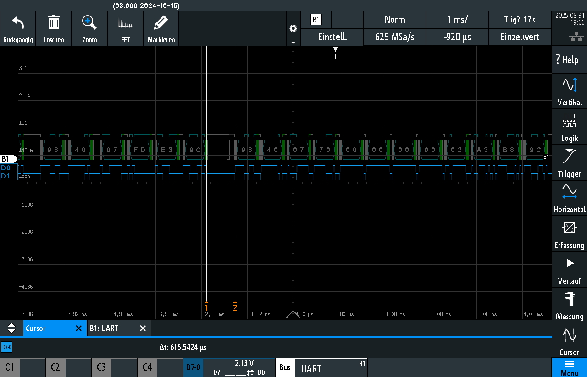

# RS485 Interface for Tylö/Helo Sauna Heaters

This interface was developed for and validated with the **Tylö Sense Pure** (Pure panel). Basic functions also worked in our tests with Combi and Elite setups, but full compatibility and feature coverage are not guaranteed. It does not emulate a control panel and cannot replace one.

---

## Hardware

### MCU

This project utilizes an **ESP32-S3 (ESP32-S3-WROOM-1)** paired with an external RS485-to-UART interface based on the **MAX485**.

### Door Sensor

The door sensor used in this project is an **ABUS FU7350W**.

### External Switch

The external switch with LED feedback used in this project can be found [here](https://amzn.eu/d/iFFPtIz).

### Sauna PCB

|  |
|:----------------------------------------------:|
| **Mikrocontroller**: `PIC32 MX150F128D` |
| **Differential Bus Transceivers**: `TI SN65176B` |                  

---

## Pinout and Wiring Diagram

### Wiring Diagram

<table>
  <tbody>
    <tr>
      <th></th>
    </tr>
  </tbody>
</table>

---

### Connector Pinout (Western Connector 4P4C)

<table>
  <thead>
    <tr>
      <th>Pin</th>
      <th>Signal</th>
      <th> </th>
    </tr>
  </thead>
  <tbody>
    <tr>
      <td>1</td>
      <td>A</td>
      <th rowspan="4"></th>
    </tr>
    <tr>
      <td>2</td>
      <td>B</td>
    </tr>
    <tr>
      <td>3</td>
      <td>12V DC</td>
    </tr>
    <tr>
      <td>4</td>
      <td>GND</td>
    </tr>
  </tbody>
</table>

---

### Pinout Table

<table>
  <thead>
    <tr>
      <th>Pos</th>
      <th>Unit</th>
      <th>Use pin</th>
      <th>Comment</th>
      <th>Pin 1</th>
      <th>Pin 2</th>
      <th>Pin 3</th>
      <th>Pin 4</th>
    </tr>
  </thead>
  <tbody>
    <tr>
      <td>1 - NTC</td>
      <td>Temp. sensor in the room</td>
      <td>2, 3</td>
      <td>10kΩ. May also be connected at Pos 4 - SEC/NTC.</td>
      <td>-</td>
      <td>10kΩ</td>
      <td>10kΩ</td>
      <td>-</td>
    </tr>
    <tr>
      <td>2 - EXT SWITCH</td>
      <td>External switch</td>
      <td>3, 4</td>
      <td>Start/Stop. Momentary or latching switch</td>
      <td>-</td>
      <td>-</td>
      <td>Switch</td>
      <td>Switch</td>
    </tr>
    <tr>
      <td></td>
      <td>External switch with LED indication</td>
      <td>2, 3, 4</td>
      <td>Start/stop operation. 12VDC max. 40mA</td>
      <td>-</td>
      <td>LED GND</td>
      <td>Switch</td>
      <td>Switch / LED 12V</td>
    </tr>
    <tr>
      <td>3 - DOOR SWITCH</td>
      <td>Door contact (NO)</td>
      <td>3, 4</td>
      <td></td>
      <td>-</td>
      <td>-</td>
      <td>Switch</td>
      <td>Switch</td>
    </tr>
    <tr>
      <td></td>
      <td>Door contact (NO) with LED indication</td>
      <td>2, 3, 4</td>
      <td>12VDC max. 40mA.</td>
      <td>-</td>
      <td>LED GND</td>
      <td>Switch</td>
      <td>Switch / LED 12V</td>
    </tr>
    <tr>
      <td>4 - SEC/NTC</td>
      <td>Combined temperature sensor/cut-out in the room</td>
      <td>2, 3</td>
      <td>Only used for certain products.</td>
      <td>Sec</td>
      <td>10kΩ</td>
      <td>10kΩ</td>
      <td>Sec</td>
    </tr>
    <tr>
      <td>5-8 - RS485</td>
      <td>Control panels</td>
      <td>1, 2, 3, 4</td>
      <td>Tylö Pure control panel, ESP32 (RS485)</td>
      <td>A</td>
      <td>B</td>
      <td>12V</td>
      <td>GND</td>
    </tr>
  </tbody>
</table>

<table>
  <tbody>
    <tr>
      <th></th>
    </tr>
  </tbody>
</table>


---

## Communication

### RS485 UART Communication Settings

<table>
  <thead>
    <tr>
      <th>Baud</th>
      <th>Bits</th>
      <th>Parity</th>
      <th>Stopbit</th>
    </tr>
  </thead>
  <tbody>
    <tr>
      <td>19200</td>
      <td>8</td>
      <td>Even</td>
      <td>1</td>
    </tr>
  </tbody>
</table>

---

### Message Format and Essential Bits

<p>These details have been reverse-engineered by analyzing intercepted communication between a heater and its control panel.  
As such, the list may not be complete or fully accurate. Further testing and validation may be required to confirm all behaviors and formats.</p>

---

### Keep-Alive Messages

<table>
  <thead>
    <tr>
      <th>Start of Frame (SOF)</th>
      <th>Address ID</th>
      <th>Message Type / Origin</th>
      <th>Data</th>
      <th>CRC</th>
      <th>End of Frame (EOF)</th>
    </tr>
  </thead>
  <tbody>
    <tr>
      <td rowspan="2"><code>0x98</code></td>
      <td rowspan="2"><code>0x40</code></td>
      <td><code>0x06</code></td>
      <td rowspan="2">0 Bytes</td>
      <td rowspan="2">2 Bytes</td>
      <td rowspan="2"><code>0x9C</code></td>
    </tr>
    <tr>
      <td><code>0x07</code></td>
    </tr>
    <tr>
      <td colspan="6">
        <strong>Explanation:</strong><br>
        <strong><code>0x06:</code></strong> Sent by the heater as a Keep-Alive request.<br>
        <strong><code>0x07:</code></strong> Sent by the control panel as a Keep-Alive acknowledgment.
      </td>
    </tr>
  </tbody>
</table>

---

### Message Structure

<table>
  <thead>
    <tr>
      <th>Start of Frame (SOF)</th>
      <th>Address ID</th>
      <th>Message Type / Origin</th>
      <th>Code</th>
      <th>Data</th>
      <th>CRC</th>
      <th>End of Frame (EOF)</th>
    </tr>
  </thead>
  <tbody>
    <tr>
      <td rowspan="4"><code>0x98</code></td>
      <td rowspan="4"><code>0x40</code></td>
      <td><code>0x06</code> (Heater Request)</td>
      <td>2 Bytes</td>
      <td rowspan="4">0–4 Bytes</td>
      <td rowspan="4">2 Bytes</td>
      <td rowspan="4"><code>0x9C</code></td>
    </tr>
    <tr>
      <td><code>0x07</code> (Panel Command)</td>
      <td>2 Bytes</td>
    </tr>
    <tr>
      <td><code>0x08</code> (Heater Data)</td>
      <td>2 Bytes</td>
    </tr>
    <tr>
      <td><code>0x09</code> (Panel Data / ACK?)</td>
      <td>2 Bytes</td>
    </tr>
  </tbody>
</table>

---

### Essential Codes and Their Descriptions

<table>
  <thead>
    <tr>
      <th>Code</th>
      <th>Direction</th>
      <th>Description</th>
    </tr>
  </thead>
  <tbody>
    <tr>
      <td><code>0x3400</code></td>
      <td>Heater → Panel</td>
      <td><strong>Light and Heater Status</strong></td>
    </tr>
    <tr>
      <td><code>0x3801</code></td>
      <td>Heater → Panel</td>
      <td><strong>Elite/Combi sensor frame</strong> (temp/RH data)</td>
    </tr>
    <tr>
      <td><code>0x4002</code></td>
      <td>Both</td>
      <td><strong>Bath Time and Maximum Temperature</strong></td>
    </tr>
    <tr>
      <td><code>0x4003</code></td>
      <td>Both</td>
      <td><strong>Overheating PCB Limit</strong></td>
    </tr>
    <tr>
      <td><code>0x4200</code></td>
      <td>Both</td>
      <td><strong>Date/Time</strong></td>
    </tr>
    <tr>
      <td><code>0x5200</code></td>
      <td>Both</td>
      <td><strong>Aux relay</strong></td>
    </tr>
    <tr>
      <td><code>0x5201</code></td>
      <td>Both</td>
      <td><strong>Aux relay</strong> </td>
    </tr>
    <tr>
      <td><code>0x5202</code></td>
      <td>Both</td>
      <td><strong>Aux relay</strong></td>
    </tr>
    <tr>
      <td><code>0x6000</code></td>
      <td>Both</td>
      <td><strong>Temperature Data:</strong> Current and target sauna temperature</td>
    </tr>
    <tr>
      <td><code>0x6001</code></td>
      <td>Both</td>
      <td><strong>Humidity control</strong></td>
    </tr>
    <tr>
      <td><code>0x7000</code></td>
      <td>Panel → Heater</td>
      <td><strong>Request Heater Status Changes</strong></td>
    </tr>
    <tr>
      <td><code>0x7180</code></td>
      <td>Heater → Panel</td>
      <td><strong>Relay/output bitmap</strong> (physical outputs X3–X18)</td>
    </tr>
    <tr>
      <td><code>0x7280</code></td>
      <td>Heater → Panel</td>
      <td><strong>Tank level</strong></td>
    </tr>
    <tr>
      <td><code>0x9000</code></td>
      <td>Both</td>
      <td><strong>Not-allowed start window</strong></td>
    </tr>
    <tr>
      <td><code>0x9400</code></td>
      <td>Heater → Panel</td>
      <td><strong>Total Uptime</strong></td>
    </tr>
    <tr>
      <td><code>0x9401</code></td>
      <td>Heater → Panel</td>
      <td><strong>Remaining Bath Time</strong></td>
    </tr>
    <tr>
      <td><code>0xB000</code></td>
      <td>Heater → Panel</td>
      <td><strong>Error Codes</strong></td>
    </tr>
    <tr>
      <td><code>0xB600</code></td>
      <td>Heater → Panel</td>
      <td><strong>Sensor Errors</strong></td>
    </tr>
  </tbody>
</table>


---

### Timing
On each bus cycle the **heater** emits a heartbeat. Under normal conditions the **panel** follows ≈600 µs later. If the panel needs to issue a command, it skips that heartbeat and sends its command ≈1.6 ms after the heater heartbeat.

We transmit only after a **panel EOF**. To avoid collisions we wait at least one byte-time at 19 200 baud (8E1 ≈ 0.57 ms) plus a small guard on the **PURE** model, then start our frame (typically ~615 µs after the panel EOF).

**COMBI / ELITE** behave slightly differently (likely due to the optional RS-485 humidity/temperature sensor). For these models we transmit ~7 100 µs after the panel EOF.


<p>Measured timing to send <code>0x07</code> (Command) to heater via ESP32.</p>

<p align="Left">
  
</p>

---

# ESPHome Default Configuaration

```yaml
substitutions:
  # — Device / Model -
  device_name: "tylo"
  model_name: "pure"                 # pure | combi | elite
  branch_ref: "main"                 # main | dev

  # — Area & Logging —
  area_name: "Sauna"
  log_level: "INFO"

  # — Board / Flash (configurable) —
  board_type: "esp32-s3-devkitc-1"   # "esp32-s3-devkitc-1", "lolin_s3"
  flash_size: "16MB"                 # "4MB" | "8MB" | "16MB"

  # — UART pins (if wired differently) —
  uart_tx_pin: "GPIO41"
  uart_rx_pin: "GPIO42"

  # — Defaults for bath/temperature —
  default_bath_temperature: "92"
  default_bath_time: "240"
  default_max_bath_temperature: "110"

  # — Climate visuals —
  min_temp_c: "40"
  max_temp_c: "110"

  # — Secrets from secrets.yaml —
  api_encryption_key: !secret api_key_sauna
  ota_password:       !secret ota_pass_sauna
  wifi_ssid_sub:      !secret wifi_ssid
  wifi_password_sub:  !secret wifi_password

esphome:
  name: ${device_name}
  friendly_name: ${device_name}
  comment: ${device_name} sauna controller

esp32:
  board: ${board_type}
  flash_size: ${flash_size}
  framework:
    type: esp-idf

external_components:
  - source:
      type: git
      url: https://github.com/f-io/esphome-tylo
      ref: ${branch_ref}
    refresh: 1s
    components: [ sauna360 ]

packages:
  base:
    url: https://github.com/f-io/esphome-tylo
    ref: main
    refresh: 1s
    files: ["packages/base.yaml"]

  model:
    url: https://github.com/f-io/esphome-tylo
    ref: main
    refresh: 1s
    files: ["models/pure.yaml"]               # pure.yaml | combi.yaml | elite.yaml
```

# secrets.yaml (example)

```yaml
# Wi-Fi
wifi_ssid: "YOUR_WIFI_SSID"
wifi_password: "YOUR_WIFI_PASSWORD"

# API & OTA for Sauna
api_key_sauna: "REPLACE_WITH_BASE64_KEY"
ota_pass_sauna: "REPLACE_WITH_STRONG_PASSWORD"
```

# Integration Example

## Home Assistant


## Apple Homekit


## Prototype

<table>
  <tbody>
    <tr>
      <th></th>
    </tr>
  </tbody>
</table>
